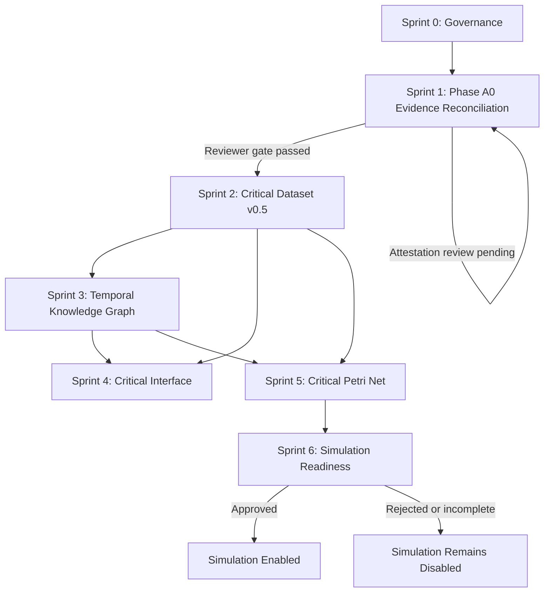

# ENCLAVE 1682 MASTER MIND

**Project:** SALIDO-HDT, Evidence-Centered Critical Historical Digital Twin  
**Application route:** `/riset/enclave-1682/`  
**Primary language:** Indonesian  
**Document role:** durable project memory, execution guide, sprint control, and handoff context for Claude Code  
**Status:** active master plan, updated with latest 41-task board handoff  
**Last consolidated:** 2 August 2026

> This document is the continuity anchor for future Claude Code sessions. Read this file before proposing, changing, testing, or committing anything related to Enclave 1682.

---


## 0A. Authoritative Continuation Snapshot

This section records the latest known project state at handoff. If this section conflicts with older planning prose elsewhere in this document, this section and the repository's committed boards take precedence. Claude Code must verify the Git state before changing any status.

**Verified update, 2 Agustus 2026** — this file was found in the repository already written; the session that updated this snapshot did not author it and independently re-verified every claim below against actual Git state, the live route, and the live solver-snapshot adapter before writing anything in. Two corrections to this document's own §7/§8 tables were identified and are noted inline where they occur below (task-ID numbering in §8 Sprint 0 and the Sprint 1 A0 ticket titles do not match the actual committed `PHASE_A0_SPRINT_BOARD.md` — that file, not this section's paraphrase, remains the ticket-level source of truth per §4's source-of-truth hierarchy).

### Latest board state

```text
Master board: COMMITTED — commit 9499285
Structured backlog: 41 tasks, COMMITTED — commit 9499285 (same commit as the board)

By status (as of commit 9499285, before any S0-04/S0-05 re-verification):
BLOCKED      34
DONE          4
IN_PROGRESS   2
BACKLOG       1

By priority:
P0           27
P1           11
P2            3
```

### Verified commit ledger

```text
4ff7dff  docs(enclave-1682): approve critical historical model plan
40365b3  docs(enclave-1682): add Phase A0 evidence reconciliation board
9499285  docs(enclave-1682): add critical model master sprint board
```

`git status -sb` confirms `main` is ahead of `origin/main` by 3 commits (not yet pushed) as of this update. This document itself (`ENCLAVE_1682_MASTER_MIND.md`) remains uncommitted — no step so far has authorized committing it, per the explicit instruction to keep it out of the board+backlog commit.

### Tasks reported as DONE

```text
S0-01  Critical model plan approved or recorded
S0-02  Phase A0 sprint board prepared or recorded
S0-03  Master-mind continuity document prepared
S1-00  Phase A0 initiation or governance checkpoint completed
```

Claude Code must verify the actual board rows and commit history before treating these as committed.

### Tasks reported as IN_PROGRESS

```text
S0-04  Record baseline commits and release mapping
S0-05  Enforce and document agent guardrails
```

The board-authoring process itself created this state. Do not silently mark these DONE. Completion requires an actual Git and documentation verification.

### Only unblocked backlog item reported at handoff

```text
S1-02  BACKLOG, no blocker, can start independently
```

Claude Code must read the master board to recover the exact title, scope, allowlist, deliverable, and acceptance criteria for S1-02 before acting.

### Evidence-retention policy correction (2 Agustus 2026)

Local image retention is **not required** by this project. `docs/SOURCE_PROVENANCE.md` requires only that a reviewer examined the source and can cite it — not that a copy lives in this repository. The prior "external blocker" framing (below, in earlier prose of this document) conflated scan access with local duplication and is superseded by this correction. `docs/enclave/scans/` does not exist and **must not be created** — no archival image is downloaded or committed under this project's policy, and absence of a local JPG is not evidence that philological review did not occur.

Verification now proceeds via reviewed external-viewer philological attestation:

```text
source_examined_externally    = pending_researcher_attestation
image_retained_locally        = false
image_retention_status        = not_retained_by_policy
verification_method           = external_archive_viewer
verified_against_local_image  = false  (never true under this policy)
canonical_extraction_status   = missing
researcher_attestation_status = draft_awaiting_researcher_completion
```

Recorded in `docs/enclave/implementation/A0_RESTRAINT_PHILOLOGICAL_ATTESTATION.md`. Once the researcher fills and approves the reading, `source_examined_externally` may be changed to `true` and `researcher_attestation_status: researcher_attested` recorded — not automatically, and not yet done as of this correction.

**The remaining open item is unchanged by this correction**: `SP-01267`/`SP-01344` exist in `00_source_passages.csv` but are absent from `10_inventory_items.csv` — a passage-to-structured-row extraction gap, tracked as P0 (`A0-4`/`A0-5`).

### Important dependency clarifications

- The two restraint passages already exist in `00_source_passages.csv` as `SP-01267` and `SP-01344`.
- The defect is passage-to-structured-row extraction, not total passage absence.
- Both passages remain `image_verified = not_checked`.
- Sprint 5 Petri Net specification is not sequentially dependent on Sprints 3 and 4; it depends on the required Sprint 2 evidence structures and may be authored with `use_evidence = not_recorded` where appropriate.
- Sprint 6 is a gate-decision sprint. Its legitimate Definition of Done may be a documented `simulation_not_authorized` decision. Sprint 6 does not promise that a simulation engine will be built.

### Immediate governance decision

Before implementation resumes:

1. ~~review the uncommitted master board and 41-task backlog~~ — **done**, reported in full (branch/HEAD, row/status/priority counts, canonical zero-diff, live route, live solver-snapshot check);
2. ~~commit the board and backlog in one narrow documentation-only commit if the diff is correct~~ — **done**, commit `9499285`, staged set verified to contain exactly the two reviewed files (`git diff --cached --name-status`), `ENCLAVE_1682_MASTER_MIND.md` deliberately excluded;
3. ~~update this document with the actual commit hash~~ — **done, this edit** (see "Verified commit ledger" above);
4. complete S0-04 and S0-05 through verification, not assumption — **not yet done**; note the real backlog CSV's `S0-04`/`S0-05` are "Author master delivery board and backlog CSV" / "Establish release mapping and sprint gate conditions," both currently `in_progress` in `ENCLAVE_1682_BACKLOG.csv` and eligible to move to `done` now that commit `9499285` exists, pending that explicit verification step;
5. select exactly one READY or unblocked task, with preference for the board's explicit priority ordering — candidate identified: `S1-02` (Workstream 2, cross-document temporal-overlap review), the only backlog-status task with no blocker;
6. do not infer or fabricate restraint-device use, target person, date of use, an original Dutch reading, a normalized reading, an IVdNT lemma, a folio number, or a confidence value — unchanged, still binding. (The scan-access blocker itself is resolved per the evidence-retention correction above; this prohibition is about *inventing content*, not about source access, and was never contingent on the blocker.)

### Recommended board commit

```text
docs(enclave-1682): add critical model master sprint board
```

The commit must contain only the reviewed master-board and backlog artifacts. It must not include canonical datasets, application code, solver code, snapshots, Docker configuration, archival source files, or unrelated untracked work.

---

## 0. Operating Mandate

Build an **evidence-centered critical historical digital twin** of the Salido or Sillida gold-mining enclave in 1682.

The product is not merely:

- a CSV dashboard;
- a production simulator;
- a solver demonstration;
- a neutral inventory browser;
- a three-dimensional reconstruction.

The product must connect:

1. archival evidence;
2. persons and aggregate group attestations;
3. roles, places, objects, operations, and time;
4. colonial accounting categories;
5. asymmetry of naming and archival visibility;
6. coercion, supervision, restricted mobility, provisioning, and armed infrastructure;
7. mathematical reconstruction with explicit uncertainty;
8. an auditable research interface at `/riset/enclave-1682/`.

### North-star question

> How did the VOC enclave at Salido operate as a connected system of people, imposed classifications, technical infrastructure, production, accounting, and coercive power, and which parts of that reconstruction are explicit, interpreted, uncertain, or solver-generated?

### Non-negotiable rule

A model result is never equivalent to an archival statement.

---

## 1. Product Identity

### 1.1 Final product

**Evidence-Centered Critical Historical Digital Twin, Enclave Salido 1682**

### 1.2 Three product layers

#### Layer A: Evidence and Archive

Answers: **What does the source actually state?**

Core objects:

- document;
- source passage;
- transcription;
- translation;
- claim;
- named person;
- aggregate group assertion;
- role;
- location;
- inventory row;
- event;
- evidence status.

#### Layer B: Critical Historical Model

Answers: **How did colonial recording create unequal visibility and administrative control?**

Core analyses:

- naming asymmetry;
- administrative aggregation;
- accounting treatment;
- provisioning and `kostgelt`;
- supervision by mandoor and mandores;
- `gecondemneerden` as a legal and coercive category;
- mobility and forced arrival;
- weapons and restraint-device evidence;
- absence of individual voice in the current corpus;
- co-location of human groups and material inventory in the same administrative regime.

#### Layer C: Mathematical Reconstruction

Answers: **Which reconstructions are compatible with the evidence?**

Components:

- temporal knowledge graph;
- Human-Role-Location-Time tensor;
- archival-visibility tensor;
- constraint solver;
- location topology;
- assay comparison;
- timed coloured Petri Net;
- alternative scenarios and uncertainty.

---

## 2. Evidence and Ethical Doctrine

### 2.1 Controlled epistemic statuses

Use and preserve:

```text
explicit
normalized
interpreted
reconstructed
parallel_reading
uncertain
needs_image_review
rejected
```

Do not promote an interpreted or reconstructed value to explicit.

### 2.2 Human modelling rules

- People subjected to slavery are historical persons, not production resources.
- Aggregate records must not be expanded into invented individuals.
- `HumanGroup.count` must never weight productivity, objective value, labour capacity, or person-hours.
- Absence from a role table is unknown, not negative evidence.
- Register presence is not automatically assignment eligibility.
- A group assertion represents the source's aggregation, not an ontological claim that many people form one person.
- The interface must distinguish record count, represented-person count, solver count, and verified unique-person count.

### 2.3 Colonial accounting claim

The critical claim is not that enslaved persons were ontologically equivalent to objects.

The supported analytical claim is:

> Colonial administration made people countable, classifiable, transferable, provisioned, supervised, and administratively adjacent to material inventory.

### 2.4 Prohibited inferences

Do not infer without evidence:

- individual identities inside unnamed groups;
- exact modern ages from `halfwasse`, `volle`, or related categories;
- individual assignment to a schicht;
- restraint use against a named or unnamed person;
- date or frequency of restraint-device use;
- a verified unique-person total across documents;
- exact underground geometry;
- modern-unit conversion for historical measures;
- voluntary labour where coercion is documented;
- five solver files as five independent historical reconstructions.

---

## 3. Aplikasi Saat Ini Berada di Mana?

This table is the executive project board. Update it after every accepted release or architecture decision.

| Component | Current status | Evidence or implementation state | Blocking issue | Next gate |
|---|---|---|---|---|
| Research source DOCX | Available | Researcher-prepared transcription, translation, notes, personnel, inventory, operations, and assay material | Not all readings are philologically attested | Attestation review per `A0_RESTRAINT_PHILOLOGICAL_ATTESTATION.md` |
| Archival scans | Consulted externally, not retained locally (by policy) | Nationaal Archief online viewer used directly; `docs/enclave/scans/` intentionally does not exist and must not be created | None — resolved by evidence-retention policy correction | Researcher completes attestation; reviewer confirms (A0-3) |
| Canonical dataset v0.4.1 | Ready and immutable | Validated schema and deterministic provenance patch | Critical evidence extensions not yet migrated | Preserve as read-only baseline |
| Source passages | Ready | Includes `SP-01267` and `SP-01344` for the two restraint entries | Passage-to-structured-row extraction gap | Phase A0 extraction trace |
| Persons | Ready at record level | 50 named-person records | Not a full population of everyone in the enclave | Add archival-visibility analysis |
| Aggregate groups | Ready at record level | 17 aggregate-group records | Parent-child and cross-document overlap incomplete | Phase A0 hierarchy and overlap review |
| Unique-person population | Unresolved | No verified cross-document unique-person count | Parent-child duplication and temporal overlap | Reviewer-approved hierarchy and overlap model |
| Restraint evidence | Textually present, structurally missing | Two explicit DOCX/source-passage entries, 5 rings plus 1 key and 3 rings plus 1 key | Missing canonical inventory rows and no image verification | Phase A0 restraint extraction audit |
| Inventory | Ready with known gap | 403 source rows, 392 non-parent items, 11 parent or container rows | Two restraint rows absent from structured inventory | Candidate correction only after audit |
| HRLT tensor | Seed implementation | Explicit and selected aggregate location assertions | Sparse and not sufficient for full reconstruction | Expand only through reviewed evidence |
| Constraint solver | Technical baseline accepted | Tests passed, CLI works, read-only snapshot, explicit schicht semantics | Three defined-but-unused model elements and count inconsistencies | Keep as feasibility layer, not truth engine |
| Solver scenarios | Available offline | 5 files, roughly 2 meaningful profiles | Scenarios 01 to 04 are diversification variants | Display as two profiles with warnings |
| Solver entity counts | Disclosed but inconsistent | 60 entity coverage, 57 internal `n_entities`, 59 adapter hierarchy interpretation | Semantics need separate investigation | Backlog issue, do not conflate with canonical 67 |
| Django route | Operational | `/riset/enclave-1682/` returns HTTP 200 | Current interface remains technically oriented | Critical interface redesign after critical dataset |
| Dataset summary UI | Operational | 50 person records, 17 group records, 67 canonical records, inventory metrics disclosed | Still visually KPI-oriented | Freeze as technical baseline |
| Critical accounting layer | Planned | Revised critical model plan approved as design baseline | Phase A0 evidence reconciliation incomplete | Complete Phase A0 |
| Critical dataset v0.5 | Not created | Schemas proposed | Hard-gated by Phase A0 sign-off | Sprint 2 |
| Temporal knowledge graph | Not implemented | Ontology concept defined | Critical dataset unavailable | Sprint 3 |
| Petri Net specification | Planned only | Production, maintenance, and coercion subnets defined conceptually | Critical evidence and graph incomplete | Sprint 5 |
| Petri Net simulation | Prohibited | No approved durations or initial marking | Evidence and assumption gate incomplete | Sprint 6 approval |
| 3D spatial reconstruction | Future | Topology must precede geometry | No reliable geometry | Do not start |
| MLOps governance | Partially ready | Immutable dataset, manifests, validation reports, narrow commits | Master board and structured backlog required | Maintain this document and boards |

### 3.1 Current technical baseline

```text
Canonical data:      v0.4.1, read-only
Application route:   /riset/enclave-1682/
Snapshot policy:     generated offline, mounted read-only
Request policy:      never run CP-SAT during a Django request
Scenario policy:     five files displayed as roughly two profiles
Petri Net policy:    specification only, simulation disabled
```

### 3.2 Canonical numbers and their meanings

```text
50  named-person records
17  aggregate-group records
67  canonical person-and-group records
403 inventory source rows
392 non-parent inventory items
11  parent or container inventory rows
23  locations
42  weekly operation records
19  assay observations
5   numeric anomalies
30  unresolved inventory readings
```

Do not use `67` as a verified count of unique historical persons.

### 3.3 Counts that must remain separate

```text
67  canonical person-and-group record count
60  solver entity_coverage list length
59  application-side independent-group interpretation
57  solver internal n_entities field
372 naive sum of aggregate count values, with parent-child duplication
308 provisional single-document de-duplicated estimate, not verified
```

Rules:

- Never display 372 as a unique-person count.
- Never use 11.8 percent as a naming rate.
- Treat 308 only as a provisional single-document estimate.
- Verified cross-document unique-person count remains unresolved.

---

## 4. Source-of-Truth Hierarchy

When sources disagree, use this order and report the disagreement:

1. archival image verified by a reviewer;
2. diplomatic transcription linked to image region;
3. researcher-prepared DOCX passage;
4. canonical source passage row;
5. structured canonical row;
6. normalization;
7. interpretation;
8. solver reconstruction;
9. UI summary.

A lower layer must not silently override a higher layer.

### Known discrepancy

```text
SP-01267: restraint with 5 rings and 1 key
SP-01344: restraint with 3 rings and 1 key
```

Both passages exist, with `image_verified = not_checked`. The related restraint rows are absent from the current structured inventory. This is a passage-to-structured-row extraction gap. It is not permission to modify v0.4.1 directly.

---

## 5. Approved Architecture

### 5.1 Data layers

```text
Bronze
  archive images
  researcher DOCX
  raw OCR or HTR

Silver
  passages
  transcription
  translation
  marginalia separation
  entity annotations
  hierarchy and overlap review
  restraint review

Gold
  canonical entities
  critical claims
  archival visibility
  accounting treatment
  coercion evidence
  temporal graph
  solver inputs
  Petri Net specification

Serving
  Django SSR
  read-only canonical data adapter
  offline solver snapshot
  future static Petri Net snapshot
```

### 5.2 Mathematical models

#### Temporal knowledge graph

Primary integration model.

Nodes:

```text
Person
AggregateAssertion
AdministrativeCategory
Role
Location
InventoryItem
CoerciveDevice
Document
SourcePassage
Claim
Event
OreBatch
Assay
```

Edges:

```text
HAS_ROLE
LOCATED_AT
RECORDED_AS
COUNTED_AS
SUPERVISED_BY
ARRIVED_FROM
HAS_COMPONENT
RECORDED_ALONGSIDE
SUPPORTED_BY
USED_AT
TRANSFERRED_TO
```

All relations require time and provenance where applicable.

#### HRLT tensor

```text
X[h, r, l, t]
```

Represents evidence support for a human entity or aggregate assertion, role, location, and time.

#### Archival-visibility tensor

```text
V[h, d, t]
```

Visibility dimensions include:

```text
named
counted
role_recorded
location_recorded
health_recorded
mobility_recorded
allowance_recorded
signature_recorded
voice_recorded
```

#### Constraint solver

Permitted purposes:

- consistency checking;
- contradiction detection;
- feasible alternatives;
- uncertainty surfacing.

Prohibited purpose:

- optimizing people subjected to slavery as labour resources.

#### Timed Coloured Petri Net

Three interacting subnets:

1. Production
2. Maintenance and social reproduction
3. Coercion and control

Simulation remains disabled until Sprint 6 approval.

---

## 6. Approved Critical Data Schemas

These are planned candidate schemas. They are not yet canonical.

```text
archival_visibility.csv
accounting_treatment.csv
coercion_evidence.csv
restraint_device_review.csv
group_hierarchy_review.csv
```

### 6.1 `archival_visibility.csv`

Purpose: record how each person or group becomes visible or invisible in the archive.

Minimum fields:

```text
visibility_id
entity_id
entity_type
named_in_source
individualized_in_source
counted_in_source
role_recorded
location_recorded
health_recorded
mobility_recorded
allowance_recorded
signature_recorded
voice_recorded
aggregation_imposed_by_source
absence_reason
source_document_id
source_passage_id
evidence_status
review_status
critical_note
```

### 6.2 `accounting_treatment.csv`

Purpose: represent administrative operations without claiming ontological equivalence between people and objects.

```text
treatment_id
subject_id
subject_type
document_id
record_section
accounting_operation
quantity_recorded
monetary_value_recorded
allowance_recorded
condition_recorded
transfer_recorded
custodian_recorded
administrative_proximity_to_inventory
evidence_status
source_passage_id
critical_interpretation
review_status
```

### 6.3 `coercion_evidence.csv`

Purpose: separate explicit coercive evidence from interpretation.

```text
coercion_evidence_id
subject_id
coercion_type
location_id
valid_from
valid_to
presence_evidence
use_evidence
target_person_evidence
source_document_id
source_passage_id
evidence_status
interpretation_status
review_status
notes
```

### 6.4 `restraint_device_review.csv`

Purpose: audit restraint evidence before migration.

```text
restraint_review_id
source_passage_id
candidate_inventory_item_id
item_original
item_translation
ring_count
key_count
recorded_location_id
inventory_section
presence_evidence
functional_interpretation
use_evidence
target_person_evidence
image_verified
extraction_audit_required
prohibited_inference_flag
review_status
critical_note
```

### 6.5 `group_hierarchy_review.csv`

Purpose: prevent parent-child double counting and document temporal overlap.

```text
relation_id
parent_group_id
child_group_id
relation_type
count_in_parent
count_in_child
mutually_exclusive
exhaustive_partition
counts_toward_unique_person_estimate
duplicate_of
valid_from
valid_to
same_document
same_event
cross_document_temporal_overlap_checked
evidence_status
review_status
notes
```

---

## 7. Phase and Release Map

| Release or phase | Role | Status |
|---|---|---|
| v0.3 | Historical structured snapshot | Immutable |
| v0.4 | Schema candidate | Immutable |
| v0.4.1 | Canonical implementation dataset | Immutable and active |
| Critical model plan | Critical redesign baseline | Approved |
| Phase A0 board | Evidence reconciliation workbench | Committed — commit `40365b3` |
| Master sprint board + 41-task backlog | Sprint 0-6 delivery roadmap | Committed — commit `9499285` |
| v0.5 candidate | Critical evidence dataset | Not created |
| Graph v0.1 | Critical temporal knowledge graph | Not created |
| Interface critical redesign | Research interface | Not started |
| Petri Net v0.1 | Structural specification | Not started |
| Simulation | Executable process model | Prohibited pending gate |

---

## 8. Master Sprint Board

### Status vocabulary

```text
BACKLOG
READY
IN_PROGRESS
BLOCKED
REVIEW
DONE
REJECTED
```

### Priority vocabulary

```text
P0  blocks downstream work
P1  required for next release
P2  important, non-blocking
P3  future enhancement
```

### Sprint 0: Baseline and Governance

| ID | Task | Priority | Status | Deliverable | Gate |
|---|---|---:|---|---|---|
| S0-01 | Commit approved critical model plan | P0 | **Done — commit `4ff7dff`** | Plan commit | Required |
| S0-02 | Commit Phase A0 sprint board | P0 | **Done — commit `40365b3`** | Board commit | Required |
| S0-03 | Create and maintain this MASTER MIND | P0 | Written, **not yet committed** | This document | Required |
| S0-04 | Record baseline commits and release mapping | P1 | **Done — commit `9499285`** (master board + backlog) | Release map update | Required |
| S0-05 | Enforce Claude Code and OpenCode guardrails | P1 | READY | Agent operating rules | Required |

**Correction (verified update, 2 Agustus 2026)**: this table's `S0-01`…`S0-05` task IDs do not correspond 1:1 to `ENCLAVE_1682_BACKLOG.csv`'s `S0-01`…`S0-05` rows — the backlog CSV defines `S0-01` as a *superseded first-draft plan* (never committed) and `S0-02` as *the revised, committed plan* (`4ff7dff`), while this table conflates both into a single `S0-01`. The backlog CSV is the machine-readable source of truth for task-level status (per §4's source-of-truth hierarchy, a structured canonical row outranks this document's prose); this table should be read as a human-readable summary, not re-derived from independently.

**Definition of Ready**

- critical plan approved;
- current Git state known;
- canonical datasets verified unchanged.

**Definition of Done**

- governance documents committed;
- no implementation started outside a ticket;
- every task has an allowlist and stop condition.

### Sprint 1: Phase A0 Evidence Reconciliation

Detailed execution board: `PHASE_A0_SPRINT_BOARD.md`.

| ID | Task | Priority | Status | Deliverable | Dependency |
|---|---|---:|---|---|---|
| A0-1 | Trace SP-01267 and SP-01344 into structured extraction | P0 | READY | Restraint extraction trace | None |
| A0-2 | Document external-viewer philological attestation | P0 | READY (template created, `draft_awaiting_researcher_completion`) | Philological attestation document | None — internal review dependency only |
| A0-3 | Approve restraint transcription and terminology | P0 | BLOCKED | Reviewer decision | A0-2 |
| A0-4 | Map Madagascar parent-child groups | P0 | READY | Hierarchy trace | None |
| A0-5 | Explain why restraint rows were omitted | P0 | BACKLOG | Root-cause report | A0-1 |
| A0-6 | Propose non-destructive candidate correction | P0 | BACKLOG | Migration proposal | A0-3 and A0-5 |
| A0-7 | Review cross-document temporal overlap | P0 | READY | Overlap matrix | None |
| A0-8 | Reconcile count tiers and prohibit invalid totals | P0 | READY | Count policy | A0-4 |
| A0-9 | Produce Phase A0 validation report | P0 | BACKLOG | Validation report | A0 workstreams |
| A0-10 | Populate review queue | P1 | BACKLOG | Review queue | A0 findings |
| A0-11 | Reviewer sign-off or explicit block decision | P0 | BACKLOG | Gate decision | A0-9 |

**Definition of Ready**

- source passages available;
- canonical dataset remains immutable;
- evidence-retention policy applied (no local scan required or permitted).

**Definition of Done**

- passage-to-row gap explained;
- hierarchy and overlap statuses explicit;
- 372 prohibited as a unique-person total;
- 308 remains provisional;
- reviewer gate recorded;
- unresolved image verification remains visibly blocked.

### Sprint 2: Critical Dataset Candidate v0.5

| ID | Task | Priority | Status | Deliverable | Dependency |
|---|---|---:|---|---|---|
| S2-01 | Create candidate release directory | P0 | BLOCKED | v0.5 candidate | A0-11 |
| S2-02 | Build archival visibility table | P0 | BACKLOG | CSV and schema | S2-01 |
| S2-03 | Build accounting treatment table | P0 | BACKLOG | CSV and schema | S2-01 |
| S2-04 | Build coercion evidence table | P0 | BACKLOG | CSV and schema | S2-01 |
| S2-05 | Build restraint review table | P0 | BACKLOG | CSV and schema | A0 findings |
| S2-06 | Build group hierarchy table | P0 | BACKLOG | CSV and schema | A0 findings |
| S2-07 | Add controlled vocabularies | P1 | BACKLOG | Vocabulary files | S2-02 to S2-06 |
| S2-08 | Add validation suite | P0 | BACKLOG | Tests and report | S2 tables |
| S2-09 | Generate migration log and manifest | P0 | BACKLOG | Audit artifacts | S2-08 |
| S2-10 | Comparative validation against v0.4.1 | P0 | BACKLOG | Validation report | S2-09 |

### Sprint 3: Critical Temporal Knowledge Graph

| ID | Task | Priority | Status | Deliverable | Dependency |
|---|---|---:|---|---|---|
| S3-01 | Finalize node ontology | P0 | BLOCKED | Graph schema | Sprint 2 |
| S3-02 | Finalize temporal and provenance edges | P0 | BACKLOG | Edge schema | S3-01 |
| S3-03 | Load persons and aggregate assertions | P1 | BACKLOG | Graph population | S3-02 |
| S3-04 | Load administrative classifications | P1 | BACKLOG | Graph population | S3-02 |
| S3-05 | Load coercion and restraint evidence | P1 | BACKLOG | Graph population | S3-02 |
| S3-06 | Link every relation to claims and passages | P0 | BACKLOG | Provenance graph | S3 population |
| S3-07 | Validate temporal and provenance integrity | P0 | BACKLOG | Graph report | S3-06 |
| S3-08 | Add read-only graph query service | P1 | BACKLOG | Query layer | S3-07 |

### Sprint 4: Critical Interface Redesign

| ID | Task | Priority | Status | Deliverable | Dependency |
|---|---|---:|---|---|---|
| S4-01 | Freeze current page as technical baseline | P0 | READY | Baseline screenshot and tests | None |
| S4-02 | Add archival-asymmetry introduction | P1 | BLOCKED | New section | Sprint 2 or 3 |
| S4-03 | Add Colonial Accounting View | P1 | BACKLOG | Interface mode | Critical data |
| S4-04 | Add Human-Centred Critical View | P1 | BACKLOG | Interface mode | Critical data |
| S4-05 | Add naming-visibility explorer | P1 | BACKLOG | Explorer | Visibility table |
| S4-06 | Add group-classification explorer | P1 | BACKLOG | Explorer | Hierarchy table |
| S4-07 | Add coercion-infrastructure panel | P1 | BACKLOG | Evidence panel | Coercion data |
| S4-08 | Move solver below evidence sections | P2 | BACKLOG | Revised information architecture | S4 core sections |
| S4-09 | Add source-to-claim drill-down | P0 | BACKLOG | Provenance UX | Graph query service |

### Sprint 5: Critical Petri Net Specification

| ID | Task | Priority | Status | Deliverable | Dependency |
|---|---|---:|---|---|---|
| S5-01 | Define Production subnet | P1 | BLOCKED | YAML or equivalent | Sprint 3 |
| S5-02 | Define Maintenance and Reproduction subnet | P1 | BACKLOG | Specification | Sprint 3 |
| S5-03 | Define Coercion and Control subnet | P0 | BACKLOG | Specification | Sprint 2 and 3 |
| S5-04 | Define typed tokens | P0 | BACKLOG | Token schema | S5 subnets |
| S5-05 | Define guards and interruptions | P0 | BACKLOG | Guard schema | S5-04 |
| S5-06 | Link transitions to evidence | P0 | BACKLOG | Evidence links | S5-05 |
| S5-07 | Validate no person or group count multiplication | P0 | BACKLOG | Structural tests | S5-04 |
| S5-08 | Build static process viewer | P2 | BACKLOG | UI viewer | Structural validation |

### Sprint 6: Simulation Readiness

| ID | Task | Priority | Status | Deliverable | Dependency |
|---|---|---:|---|---|---|
| S6-01 | Review duration evidence | P0 | BLOCKED | Duration register | Sprint 5 |
| S6-02 | Review initial marking | P0 | BACKLOG | Initial marking report | Sprint 5 |
| S6-03 | Review capacity bounds | P0 | BACKLOG | Capacity report | Sprint 5 |
| S6-04 | Decide health-state activation | P1 | BACKLOG | Decision record | Solver review |
| S6-05 | Decide movement-penalty activation | P1 | BACKLOG | Decision record | Solver review |
| S6-06 | Map scenario profiles to initial markings | P1 | BACKLOG | Mapping | S6 evidence |
| S6-07 | Approve or reject simulation | P0 | BACKLOG | Gate decision | All S6 items |

---

## 9. Dependency Graph



---

## 10. Claude Code Operating Contract

Every Claude Code session must begin by reading this file and the relevant sprint board.

### Required task header

```text
Task ID:
Sprint:
Goal:
Allowed files:
Prohibited files:
Evidence requirement:
Expected deliverable:
Tests:
Stop condition:
Commit policy:
```

### Default prohibitions

Unless explicitly authorized:

- do not edit canonical v0.3, v0.4, or v0.4.1;
- do not edit source inside a Docker container;
- do not use `sed -i`, `perl -pi`, global replacement, or hardcoded line-number rewrites;
- do not run solver during HTTP requests;
- do not invent missing evidence;
- do not change tests merely to follow current output;
- do not use `git add`, `commit`, `push`, `restore`, `reset`, `clean`, or force operations;
- do not proceed after the first unexpected failure;
- do not expand scope automatically.

### Three-turn execution pattern

1. **Analysis only:** inspect, diagnose, propose exact diff, stop.
2. **Approved edit:** modify allowlisted files, show diff, stop.
3. **Verification only:** run tests and route checks, do not edit on failure.

### Loop prevention

Maximum unreviewed edit attempts per failure: **one**.

If verification fails:

- stop;
- preserve the diff;
- report the exact failure;
- do not attempt another fix in the same turn.

---

## 11. Git and Release Policy

### Narrow commits

Each commit must have one purpose:

```text
docs
schema
migration
validation
solver
application
Petri Net
```

Do not mix source-data migration with UI work.

### Required pre-commit checks

```text
git status --short
git diff --stat
git diff --name-status
canonical-directory zero-diff check
focused tests
full relevant suite
```

### Push policy

- fetch first;
- no force push;
- stop if branch is behind or diverged;
- untracked files do not enter a push unless committed;
- report the full pushed commit hash.

### Candidate release policy

Every data release must include:

```text
README.md
CHANGELOG.md
MANIFEST.csv
MIGRATION_LOG.csv
VALIDATION_REPORT.md
REVIEW_QUEUE.csv
schemas/
vocab/
```

---

## 12. Immediate Next Actions

Use this sequence. Do not skip the governance gate.

### Step 1: Read and verify the uncommitted board artifacts

Claude Code must locate the master board and the 41-row backlog, then report:

```text
exact file paths
row count
status counts
priority counts
blocked dependency chains
uncommitted diff
```

No implementation in this step.

### Step 2: Commit the master board and backlog

Only after review, create a narrow documentation-only commit.

Suggested message:

```text
docs(enclave-1682): add critical model master sprint board
```

After committing, record the full hash in the release map and in this document.

### Step 3: Close the governance tasks

Verify and complete:

```text
S0-04  baseline commits and release mapping
S0-05  Claude Code and OpenCode guardrails
```

Do not mark these DONE solely because documentation exists. Confirm that references, commit hashes, allowlists, stop conditions, and agent rules are accurate.

### Step 4: Select one executable task

At the latest handoff, `S1-02` was reported as the only BACKLOG task without a blocker. Read its exact row in the board before execution.

Use the required task header:

```text
Task ID:
Sprint:
Goal:
Allowed files:
Prohibited files:
Evidence requirement:
Expected deliverable:
Tests:
Stop condition:
Commit policy:
```

First turn must be analysis-only.

### Step 5: Attestation-based verification, not local-image possession

`docs/enclave/scans/` intentionally does not exist and must not be created — no archival image is downloaded or committed under this project's evidence-retention policy. Verification proceeds via reviewed external-viewer philological attestation instead of a locally-stored image. Do not fabricate a reading, folio number, IVdNT lemma, or confidence value the researcher has not actually recorded.

Allowed:

- trace existing source passages;
- diagnose passage-to-row extraction;
- build review queues;
- model group hierarchy;
- assess cross-document overlap;
- record a researcher's external-viewer attestation once actually provided, into the blank fields of `A0_RESTRAINT_PHILOLOGICAL_ATTESTATION.md`;
- write Petri Net structural specifications using explicit unknown or not-recorded states.

Not allowed, regardless of verification method:

- set `verified_against_local_image=true` (never true under this policy — distinct from `researcher_attestation_status=researcher_attested`);
- invent a folio number, reading, normalized reading, IVdNT lemma, or confidence value not actually supplied by the researcher;
- infer restraint-device use, target person, or date of use from any source;
- close A0-3/A0-6, or flip `source_examined_externally` to `true`, without an actual reviewer-confirmed attestation document.

---

## 13. Current UI Policy

The existing page is a technical baseline, not the final scholarly interface.

Freeze current functionality until Sprint 4 except for defects that:

- misstate evidence;
- hide provenance;
- break read-only behavior;
- produce incorrect canonical counts;
- cause route or accessibility failure.

The future interface order is:

1. Enclave as a system of power
2. Archival asymmetry
3. Colonial Accounting View
4. Human-Centred Critical View
5. Persons and aggregate attestations
6. Location topology
7. Production and coercion infrastructure
8. Mathematical reconstruction
9. Solver scenarios
10. Methodology and evidence drill-down

The solver must not lead the page.

---

## 14. Definition of Project Success

The project is successful when a researcher can move through this chain:

```text
visual element
-> historical claim
-> evidence status
-> structured row
-> source passage
-> document
-> archival scan (viewed externally, attestation recorded) or explicit gap
```

And for model results:

```text
scenario result
-> assumptions
-> constraints
-> supporting evidence
-> uncertainty
-> alternative reconstruction
```

The project is not successful merely because:

- the route renders;
- all tests pass;
- the solver returns scenarios;
- a Petri Net animates;
- a 3D model appears convincing.

The project succeeds only when the reconstruction is useful, critical, ethically defensible, and fully auditable.

---

## 15. Handoff Prompt for a New Claude Code Session

Copy this at the start of a fresh Claude Code session:

```text
Read completely before doing anything:

1. docs/enclave/implementation/ENCLAVE_1682_MASTER_MIND.md
2. docs/enclave/implementation/ENCLAVE_1682_CRITICAL_MODEL_PLAN.md
3. docs/enclave/implementation/PHASE_A0_SPRINT_BOARD.md

Then inspect Git status and recent history.

Do not modify any file in the first turn.

Report:
- current branch and HEAD;
- exact paths and Git state of the master board and structured backlog;
- backlog row count and counts by status and priority;
- current branch divergence from remote;
- status of canonical v0.4.1;
- status of the Django technical baseline;
- status of the offline solver snapshot;
- status of Phase A0 tickets;
- external blockers and their downstream propagation;
- the exact title and scope of S1-02;
- the single highest-priority executable task.

Use the task header required by the MASTER MIND.
Stop after reporting. Do not edit, stage, commit, push, or implement until the task is approved.
```

---

## 16. Maintenance Instructions

Update this document only when one of the following changes:

- release status;
- approved architecture;
- critical evidence finding;
- sprint gate;
- baseline commit;
- external blocker;
- canonical count semantics;
- product direction.

Do not use this document as a daily log. Put execution details in ticket-specific reports and commit history.
