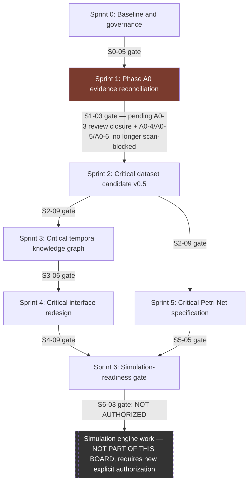

# Enclave 1682 — Master Delivery Board: Critical Historical Digital Twin

Status: **planning only — no sprint below has started, no A0 ticket has been executed**
Companion files: `ENCLAVE_1682_CRITICAL_MODEL_PLAN.md` (commit `4ff7dff`), `PHASE_A0_SPRINT_BOARD.md` (commit `40365b3`), `ENCLAVE_1682_BACKLOG.csv` (41 tasks, this directory, machine-readable companion to this board).

This board does not duplicate Phase A0's eleven ticket descriptions — Sprint 1 below references `PHASE_A0_SPRINT_BOARD.md` by ticket ID (`A0-1`…`A0-11`). That file remains the single source of truth for Phase A0 ticket-level status; this board tracks it only at workstream granularity.

---

## Release mapping (current, as of this board's creation)

| Artifact | Status | Reference |
|---|---|---|
| Canonical dataset | **v0.4.1, immutable** | `docs/enclave/salido_hdt_model_v0_4_1/` — unchanged by every commit in this programme so far |
| Critical model plan | **Approved as design baseline** | commit `4ff7dff` |
| Phase A0 evidence-reconciliation board | **Approved as operational board** | commit `40365b3` |
| Master delivery board (this document) | **Planning only, not committed this turn** | — |
| Critical dataset candidate v0.5 | **Not created** | gated behind Sprint 1 (Phase A0 sign-off), built in Sprint 2 |
| Django page (`/riset/enclave-1682/`) | **Technical baseline** — current shipped state, most recently corrected in commit `ce74aca` (field-name/entity-count fix) | unchanged by this programme until Sprint 4 |
| Solver snapshot (`frontend/map_app/data/enclave_1682_solver_run/`) | **Technical baseline** — unchanged | out of scope for this entire programme |
| Critical Petri Net | **Not implemented** — production-only net remains "Specification in Development" per existing `docs/PETRI_NET_MODEL.md` | specification work begins Sprint 5 |
| Simulation (any engine, any subnet) | **Prohibited until Sprint 6 approval** | Sprint 6 produces a gate *decision record*, not a simulation engine — see Sprint 6 Definition of Done |

No task on this board or in `ENCLAVE_1682_BACKLOG.csv` changes any row of this table except by explicit sign-off gate tasks (`S0-05`, `S2-09`, `S3-06`, `S4-09`, `S5-05`, `S6-03`).

---

## Sprint overview

| Sprint | Name | Epic (backlog CSV) | Gate condition to enter | Task count |
|---|---|---|---|---|
| 0 | Baseline and governance | Governance & Baseline | none — retroactively documents already-approved artifacts | 5 |
| 1 | Phase A0 evidence reconciliation | Evidence Reconciliation | Sprint 0 sign-off (`S0-05`) | 4 (references 11 A0 tickets) |
| 2 | Critical dataset candidate v0.5 | Critical Dataset v0.5 | Sprint 1 gate (`S1-03`) | 9 |
| 3 | Critical temporal knowledge graph | Knowledge Graph | Sprint 2 gate (`S2-09`) | 6 |
| 4 | Critical interface redesign | Interface Redesign | Sprint 3 gate (`S3-06`) | 9 |
| 5 | Critical Petri Net specification | Petri Net Specification | Sprint 2 gate (`S2-09`) — does not require Sprint 3/4, may run in parallel | 5 |
| 6 | Simulation-readiness gate | Simulation-Readiness Gate | Sprint 5 gate (`S5-05`) | 3 |

**Sprint 5 is not sequentially dependent on Sprint 3/4** — the Petri Net specification only needs the critical dataset (Sprint 2) to reference correctly; it does not need the graph layer or the UI. This is reflected in the dependency graph below.

---

## Mermaid dependency graph

The dashed "Simulation engine work" node is intentionally outside every sprint on this board — Sprint 6's deliverable is a gate decision *about* that node, never the node's implementation.

---

## Definition of Ready / Definition of Done, per sprint

### Sprint 0 — Baseline and governance
- **DoR**: N/A — this sprint documents already-completed work retroactively.
- **DoD**: `ENCLAVE_1682_CRITICAL_MODEL_PLAN.md` and `PHASE_A0_SPRINT_BOARD.md` both committed and approved (done — `4ff7dff`, `40365b3`); this master board and backlog CSV written (this turn); release mapping table above matches the instructed mapping exactly.

### Sprint 1 — Phase A0 evidence reconciliation
- **DoR**: Sprint 0 complete; `PHASE_A0_SPRINT_BOARD.md` exists and is approved.
- **DoD**: `A0-6` (Workstream 1 reviewer sign-off) **and** `A0-11` (Workstream 2 reviewer sign-off) both recorded in `PHASE_A0_SPRINT_BOARD.md`; `S1-03` gate task closed. Workstream 2 already closed. Workstream 1: `A0-1`/`A0-2` done (attestation committed `f98cfb0`), `A0-3` in Review (object identity and counts attested; exact original Dutch spelling, folio, viewer scan sequence, and IVdNT lemma not yet recorded), `A0-5` ready for read-only diagnosis, `A0-4`/`A0-6` still blocked on their own dependencies. `docs/enclave/scans/` must not be created.

### Sprint 2 — Critical dataset candidate v0.5
- **DoR**: Sprint 1's `S1-03` gate closed (both workstreams signed off).
- **DoD**: All 5 required schemas (`archival_visibility.csv`, `accounting_treatment.csv`, `coercion_evidence.csv`, `restraint_device_review.csv`, `group_hierarchy_review.csv`) plus the 2 supplementary schemas exist under `docs/enclave/salido_hdt_critical_layer_v0_1/`, each with a passing derivation test named in plan §16; `HUMAN_GROUP_HIERARCHY` migrated out of `enclave_data.py`; `MANIFEST.csv` hash-verified; the Madagascar de-duplication regression test (`test_group_hierarchy_review_madagascar_parent_and_children_not_both_counted`) passes; reviewer sign-off recorded at `S2-09`. **Canonical dataset `v0.4.1` remains byte-for-byte unchanged** — this is a release-blocking DoD condition, verified by `git diff` against the three canonical directories before sign-off, exactly as done for every prior commit in this programme.

### Sprint 3 — Critical temporal knowledge graph
- **DoR**: Sprint 2's `S2-09` gate closed (critical dataset candidate v0.5 signed off).
- **DoD**: View A and View B read models implemented as adapter methods, read-only; dual-ontology separation test passes; temporal indexing does not infer missing date ranges; node/edge type completeness test passes against plan §6's exact list; reviewer sign-off recorded at `S3-06`.

### Sprint 4 — Critical interface redesign
- **DoR**: Sprint 3's `S3-06` gate closed.
- **DoD**: All 10 page-architecture items from plan §11 implemented; zero bare count figures without a tier label; zero restraint iconography anywhere on the page; solver section relocated to DOM position 8; existing 198-test `map_app` suite (baseline: commit `ce74aca`) still passes with zero regressions; accessibility pass complete; reviewer sign-off **and** explicit ship-vs-feature-flag decision recorded at `S4-09`.

### Sprint 5 — Critical Petri Net specification
- **DoR**: Sprint 2's `S2-09` gate closed. (Does not require Sprint 3 or 4.)
- **DoD**: Subnet 2 and Subnet 3 specifications authored in `CRITICAL_PETRI_NET_MODEL.md`; `Restraint_Device_Context` guard behaviour documented exactly per plan §7 (presence-only, use-arc structurally blocked); static guard tests for P3 (no optimization objective) and P6 (no specific-person targeting) both pass; reviewer sign-off explicitly states **"specification only, not simulation"** at `S5-05`. Zero executable simulation code exists anywhere in this sprint's deliverables.

### Sprint 6 — Simulation-readiness gate
- **DoR**: Sprint 4's `S4-09` gate **and** Sprint 5's `S5-05` gate both closed.
- **DoD**: Ethical re-review memo on file (`S6-01`); simulation-readiness criteria checklist written and agreed (`S6-02`); gate decision record written stating simulation is **not authorized** by this sprint and requires a new, separate, explicit human decision beyond everything in this programme (`S6-03`). **This sprint's Definition of Done is explicitly the production of a "not yet authorized" record — it is not, and cannot become, the authorization itself.**

---

## Explicit gate conditions (summary)

| Gate task | Blocks | Cannot pass until |
|---|---|---|
| `S0-05` | Sprint 1 | Release mapping and gate conditions agreed (this document) |
| `S1-03` | Sprint 2 | Both A0 workstreams (`A0-6`, `A0-11`) reviewer-signed in `PHASE_A0_SPRINT_BOARD.md` |
| `S2-09` | Sprint 3, Sprint 5 | All Sprint 2 schemas built, tested, hash-verified; canonical dataset diff confirmed empty |
| `S3-06` | Sprint 4 | Dual-ontology separation test passes; graph type-completeness test passes |
| `S4-09` | Sprint 6 | Full page test suite passes incl. existing 198-test baseline; ship-vs-flag decision made |
| `S5-05` | Sprint 6 | Static P3/P6 guard tests pass; "specification only" stated verbatim in sign-off |
| `S6-03` | Any future simulation work | Never, by this board alone — always requires a new explicit human authorization not contained in this programme |

---

## External-evidence blockers

| Former/current item | Affects | Current state | Resolution |
|---|---|---|---|
| ~~Archival scan access~~ (Nationaal Archief, Den Haag — Access 1.04.02, Inventory 7964) | `S1-01`, and partially `S2-03`/`S2-04`/`S4-05` | **Resolved.** Local image retention was never required by `docs/SOURCE_PROVENANCE.md`. Researcher completed `A0_RESTRAINT_PHILOLOGICAL_ATTESTATION.md` (`researcher_attestation_status=researcher_attested`, committed `f98cfb0`); `docs/enclave/scans/` correctly remains absent. | Closed — `A0-2` done |
| **Attestation completeness gap** (original Dutch spelling, folio number, viewer scan sequence, IVdNT lemma not recorded) | `S1-01` (`A0-3`) | Object identity and recorded quantities are attested; these four fields remain open by design — nothing was invented to fill them | Internal — reviewer decides whether to close `A0-3` on object-and-count attestation alone, or require the remaining fields first |
| **Passage-to-structured-row extraction gap** (`SP-01267`/`SP-01344` exist in `00_source_passages.csv` but are absent from `10_inventory_items.csv`) | `S1-01` (`A0-4`/`A0-5`) | Unaffected by the evidence-retention correction — this is the actual remaining P0 issue, not a source-access problem. `A0-5` is now ready to start as a **read-only diagnosis** — it must not modify `v0.4.1` and does not authorize any migration. | Internal — `A0-4` populates `restraint_device_review.csv`, `A0-5` documents the extraction-gap audit outcome |
| **Cross-document corpus review exhaustiveness** | `S1-02` | Already resolved — `S1-02` closed, see `CROSS_DOCUMENT_OVERLAP_FINDINGS.md` | Closed |
| **Reviewer availability** (a person other than this plan's author, per `docs/ETHICAL_MODELING.md`'s spirit and this board's repeated "named reviewer" requirement) | Every gate task (`S0-05`, `S1-03`, `S2-09`, `S3-06`, `S4-09`, `S5-05`, `S6-01`, `S6-03`) | Not currently identified on this board — this board deliberately leaves `owner` blank throughout (see `ENCLAVE_1682_BACKLOG.csv`), consistent with `PHASE_A0_SPRINT_BOARD.md`'s existing convention | Research owner, to assign |

Sprint 4 (`S4-05`)'s badges still read "audit pending" until `A0-6` closes — that status is now driven by attestation-review and extraction-gap resolution, not by scan availability.

---

## Rollback and migration policy

- **Every sprint's deliverables are additive and independently revertable**, per plan §15's closing line ("Each phase is independently revertable; none requires any change to `docs/enclave/salido_hdt_model_v0_4_1/` itself") — this board inherits that property unchanged. Reverting Sprint 4's page changes, for example, does not require reverting Sprint 2's schema files or Sprint 3's adapter methods.
- **No sprint on this board ever modifies the canonical dataset** (`docs/enclave/salido_hdt_model_v0_3/`, `v0_4/`, `v0_4_1/`). If Sprint 1's `S1-01` extraction audit eventually recommends adding the two restraint-device rows to a canonical release, that is explicitly **out of scope for this entire board** — plan §17 requires it to be a separate, future `MIG-NNN`-style proposal producing a new canonical version (e.g. `v0_4_2`), reviewed on its own, not bundled into any sprint here.
- **Critical dataset candidate v0.5 is versioned independently of the canonical dataset** — a defect found in it after Sprint 2 sign-off does not imply anything wrong with `v0.4.1`; the fix is a new critical-layer patch, not a canonical migration.
- **Rollback of a signed-off gate** (e.g., discovering a Sprint 2 schema was wrong after Sprint 3 already started): the affected gate's sign-off is revoked in this board's release-mapping table, the dependent sprint's tasks return to `blocked` status in `ENCLAVE_1682_BACKLOG.csv`, and work does not resume on the dependent sprint until the gate is re-signed. No sprint should treat a prior gate's sign-off as permanent once a defect is found in what it approved.
- **Application-code changes (Sprint 2's `enclave_data.py` migration, Sprint 4's template/view changes) follow this project's existing TDD and rebuild discipline** (`CLAUDE.md` root) — every such change ships with a failing-test-first commit and a `docker compose up -d --build frontend` verification pass, exactly as done for commit `ce74aca` earlier in this project's history. Nothing in this board relaxes that requirement.
- **Docker configuration**: the only anticipated future change across this entire board is one new read-only mount for the critical-layer directory (plan §18), and it is explicitly not authorized by this board — it requires its own review at whichever sprint (S2 or S3) first needs it, following the existing `salido_hdt_model_v0_4_1:ro` mount pattern exactly, never a broader Docker change.

---

## What this board does not do

- Does not execute any Phase A0 ticket (`A0-1`…`A0-11` remain exactly as recorded in `PHASE_A0_SPRINT_BOARD.md`, all `Backlog` or `Blocked`).
- Does not modify any canonical dataset, application source, solver source, solver snapshot, or Docker configuration.
- Does not authorize simulation, now or at any predetermined future date — Sprint 6 produces a gate record, not an authorization.
- Does not assign owners or estimate delivery dates — this board tracks dependency and evidence status, not team capacity, consistent with `PHASE_A0_SPRINT_BOARD.md`'s established convention for this solo/small-team research project.

---

*End of master board. No canonical dataset, solver snapshot, application code, solver source, or Docker configuration was modified while writing this document or `ENCLAVE_1682_BACKLOG.csv`. Neither file has been committed — per instruction, this turn stops after writing both.*
